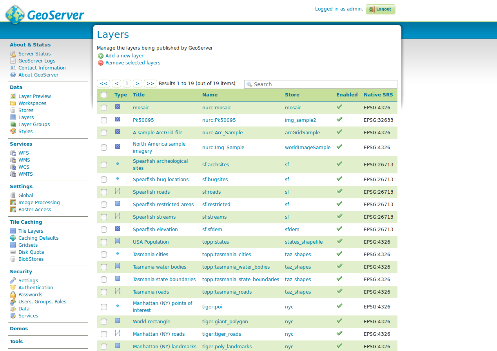
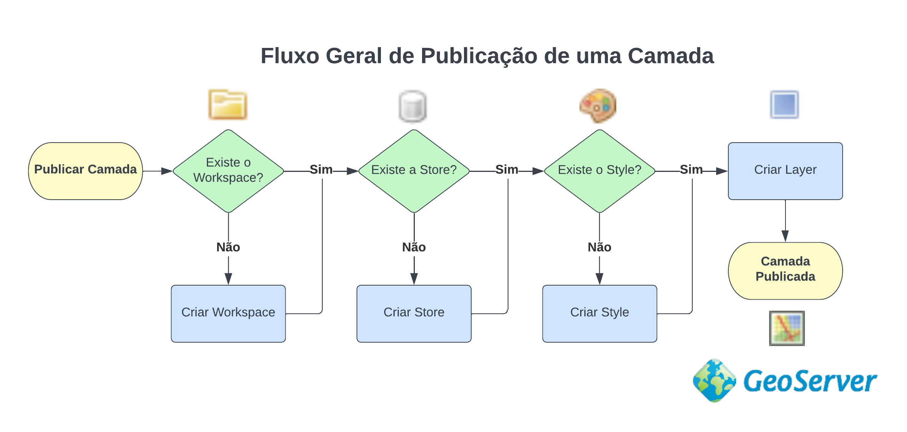

## 1. Introdução

O **GeoServer** é um servidor de código aberto para o compartilhamento de
dados espaciais. Tem como foco a interoperabilidade de dados, possibilitando a publicação de vários formatos, utilizando padrões abertos da [Open Geospatial Consortium (OGC)](https://www.ogc.org/).

O **GeoServer** possui uma excelente documentação, dividida em duas seções: documentação do usuário e do desenvolvedor:

* Documentação do usuário: https://docs.geoserver.org/stable/en/user/
* Documentação do desenvolvedor: https://docs.geoserver.org/stable/en/developer/

<div align="center">

[](https://www.youtube.com/watch?v=0qoWrPOyerE)

WebGIS: Conheça o GeoServer | VasGeo

</div>

### Instalação do GeoServer no Windows:

<div align="center">

[](https://www.youtube.com/watch?v=Y4p701Q9Now "Como instalar PostgreSQL com PostGIS no Windows")

Como instalar o GeoServer | Geocursos

</div>


### Interface Administrativa

Uma vez instalado o GeoServer, é possível logar no mesmo através do link: http://localhost:8080/geoserver, com as seguintes credenciais:

* Usuário: `admin`
* Senha: `geoserver`

A tela abaixo mostra a tela de boas vindas do GeoServer após o login do usuário:


### Layer Preview


A tela **Layer Preview** fornece uma visão geral de todas as camadas publicadas. É possível identificar o tipo de cada camada através da lista de ícones abaixo:


| Tipo | Descrição |
|:---:|--------------|
|  | camada vetorial (tipo não definido) |
|  | camada vetorial (ponto) |
|  | camada vetorial (arco) |
|  | camada vetorial (polígono) |
|  | camada raster |
|  | grupo de camadas |
|  | WMS em cascata |


No GeoServer, a maneira mais prática de visualizar uma camada é através da opção **OpenLayers**, onde uma página web é aberta com o [OpenLayers](https://openlayers.org/), que então exibe a camada selecionada, como mostra a figura abaixo:


### Workspaces


O **Workspace** serve para organizar os itens no GeoServer de forma semelhante a uma pasta em um sistema operacional.

O GeoServer armazena as camadas em um Workspace utilizando uma hieraquia de pastas, como mostra o exemplo abaixo:

```
workspace_pb
|
├── municipios
│   ├── datastore.xml
│   └── municipios
│       ├── featuretype.xml
│       └── layer.xml
├── srtm_pb
│   ├── coveragestore.xml
│   └── srtm_pb
│       ├── coverage.xml
│       └── layer.xml
├── styles
│   ├── estilo_padrao.sld
│   ├── estilo_padrao.xml
│   ├── meso.sld
│   ├── meso.xml
│   ├── poptotal.sld
│   ├── poptotal.xml
│   ├── srtm_pb.sld
│   └── srtm_pb.xml
└── workspace.xml

```


### Stores


O Store realiza a conexão a uma fonte de dados vetorial ou raster. Cada Store é atribuída a um único Workspace.

### Styles


O Style define a apresentação visual (simbologia) da camada através da linguagem *Styled Layer Descriptor (SLD)*.

A sintaxe de um arquivo SLD pode ser gerada através de softwares de SIG, tais como: QGIS, uDig, OpenJump, entre outros.

Mais informações sobre a linguagem SLD podem ser obtidas através dos links abaixo:

* Pontos: https://docs.geoserver.org/stable/en/user/styling/sld/cookbook/points.html
* Linhas: https://docs.geoserver.org/stable/en/user/styling/sld/cookbook/lines.html
* Polígonos: https://docs.geoserver.org/stable/en/user/styling/sld/cookbook/polygons.html


### Layers



Este termo no GeoServer, refere-se a dados vetoriais ou matriciais publicados no servidor. Caso o dado seja vetorial, os layers são denominados de
*Feature Types* e para os dados matriciais estas camadas são denominadas de *coverages*.


## Fluxo Geral de Publicação de uma Camada no GeoServer


