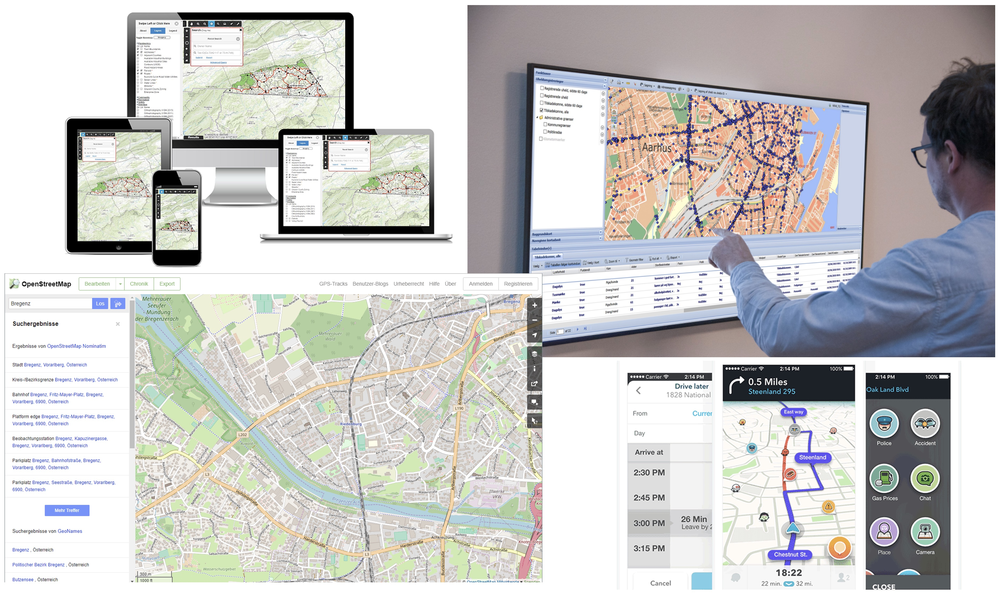
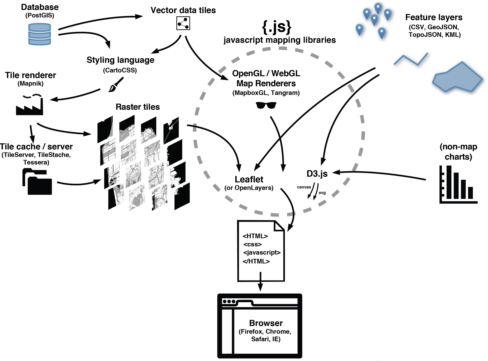

## 1. SIG-Web: uma Abordagem Geral

SIG-WEB (Sistema de Informação Geográfica para Web) pode ser definido como um conjunto de tecnologias e técnicas que permitem a criação de aplicativos de SIG na web. Esse tipo de sistema permite a visualização, análise e compartilhamento de dados geográficos na internet.

### Principais Tecnologias de um WebGIS

<small>FONTE: https://maptime.io/anatomy-of-a-web-map</small>

